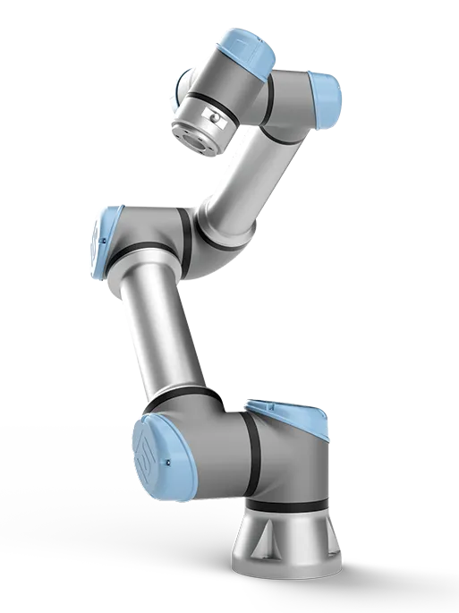

---
tags:
    - Robots
    - UR5e
---

The Universal Robots UR5e is a lightweight, 6-axis collaborative robotic arm (cobot) designed to work safely alongside humans.

{ align=left width=30%}

## Quick Links

- [Usage Log](https://forms.osi.office365.us/Pages/ResponsePage.aspx?id=ornV8r1eukKGkKENa77QhaitGsMoaXhKjfcIL8FHNQRUNDBKM1ZUOEk0VVMwTkw2NklKMzE3WjU4US4u&r55f82002aef5477796287c3ad781e107=ur-ur5e-01): All activity on the UR5e must be logged. Follow this link to update the log. 
- [Machine Calendar](https://outlook.office365.us/book/DTCModelShop@udri.udayton.edu/s/O-mHh3b4aUmmYF0yY0RVQw2?ismsaljsauthenabled): Book time with the UR5e or see when it's available. Users with reservations will have priority access. 

## References

- [User Manual](https://www.universal-robots.com/manuals/EN/PDF/SW5_19/user-manual-UR5e-PDF_online/710-965-00_UR5e_User_Manual_en_Global.pdf)

## Getting Started

Before using the UR5e, you must complete hands-on training. Schedule time [here](https://outlook.office365.us/book/DTCModelShop@udri.udayton.edu/s/0L9_bBFsukK22-TNOZ645A2?ismsaljsauthenabled) or contact [Ryan Kuederle](mailto:ryan.kuederle@udri.udayton.edu?subject=Universal%20Robots%20UR5e%20Training).

After completing training, you can reference the [UR5e Standard Operating Procedures](sop.md) during regular use. Guides for advanced features will be made available in the future. 