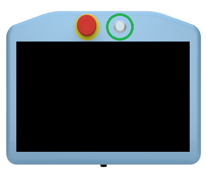
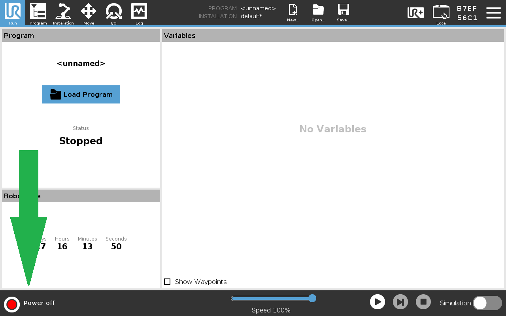
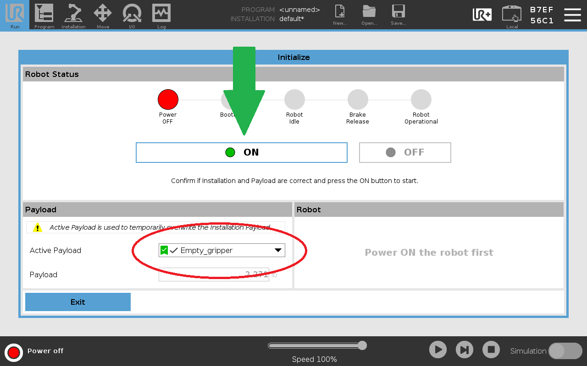
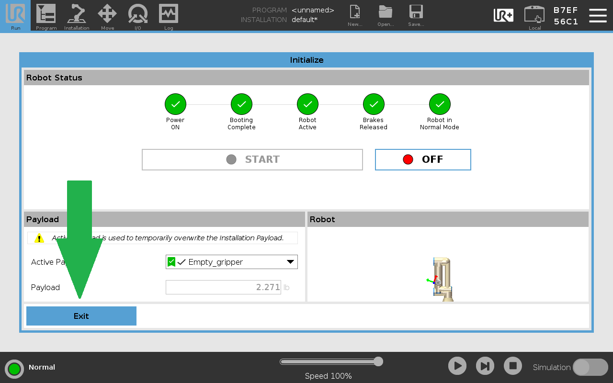
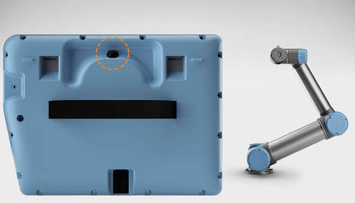
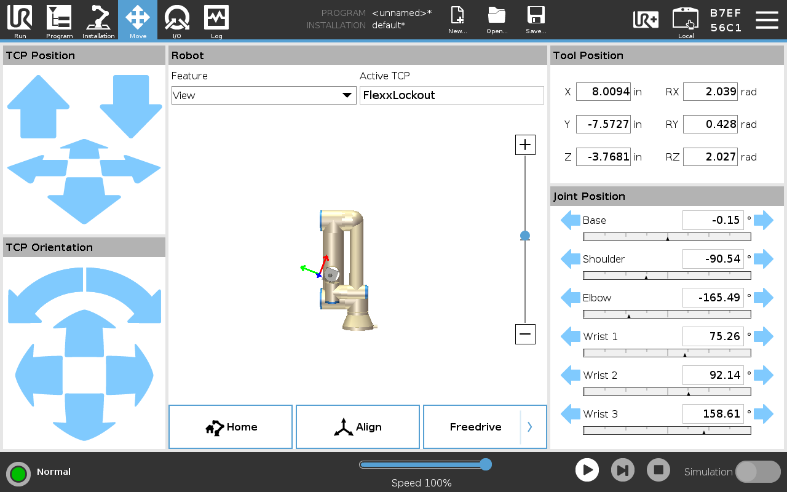
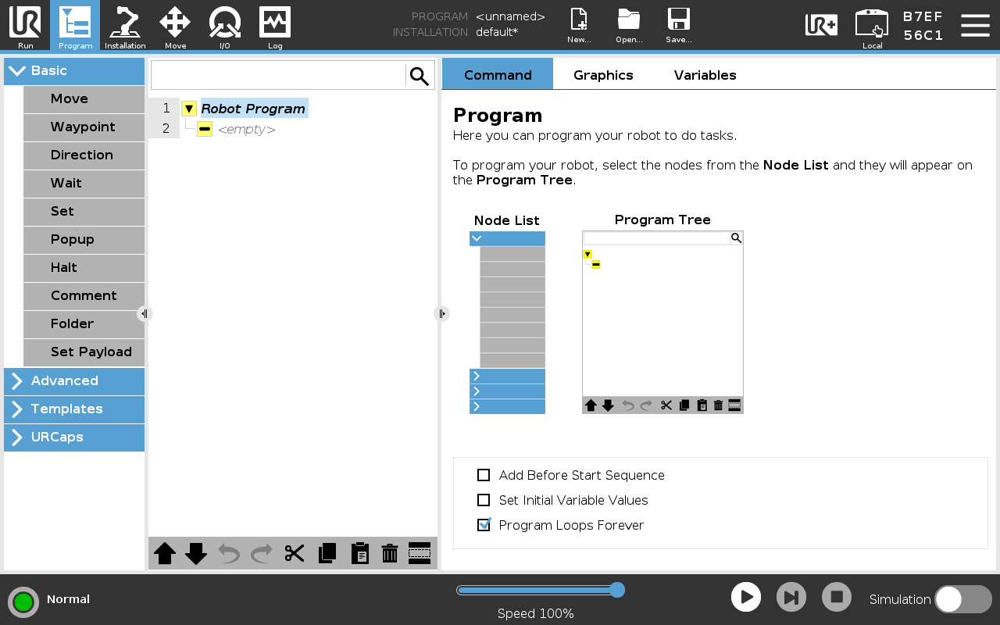
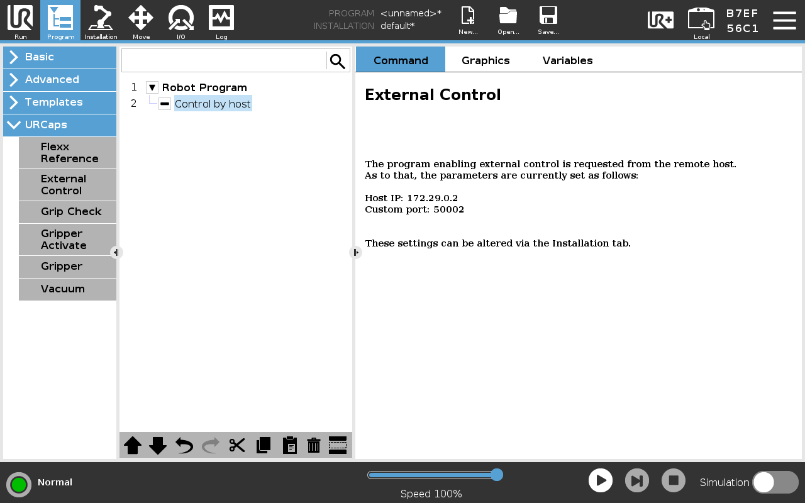

---
tags:
- Robot
- UR5e
- SOP
---

## Pre-Start Checklist

- [ ] Completed hands-on operational training.
- [ ] Cleared workspace and ensured UR5e is safe from colliding with surroudings.
- [ ] Ensured tool installation is secure.
- [ ] Detatched the teach pendant and moved away from the robot.
- [ ] Deactivated emergency-stop switch.

    <strong>Warning:</strong> Do not start the robot before all pre-start checklist items are completed.

!!! warning

        Do not move the UR5e from its current location. Doing so risks damage to property. 

??? info "Starting the Robot"

    Power on the UR5e by pressing and releasing the power button on the front of the teach pendant. The button should glow green and the system will boot to the home screen.

    { .center }

    On the teach pendant, press the power control button in the bottom left, which should indicate that the robot is powered off. 

    { .center }

    Before powering on the robot, be sure the correct payload is selected. This selection affects how the robot counteracts the payload mass during operation. Once the payload is confirmed, press the *ON* button to power on the robot. 

    { .center }

    After the robot is powered on and initialized, ensure the workspace around it is clear from anything the robot might collide with. Then, press the *START* button. The brakes will audibly release, and the robot is ready for operation. After the robot starts, press the *Exit* button to return home. 

    { .center }

??? info "Basic Controls"

    ## Basic Controls
    
    ### Manual Manipulation

    To manipulate the robot with your hands, hold the Freedrive button located on the back of the pendant. While this button is depressed, you can manually manipulate the robot's joints. Before entering Freedrive, be sure the active payload is accurate and is not holding any additional mass. Payload calibration is especially important when using Freedrive. 

    

    ### Moving with the Pendant

    To move the robot using the pendant, navigate to the *Move* menu by clicking the Move icon in the top left of the screen. To move the tool head, use the arrow controls on the left-hand side of the control in terface. The clickable arrows correspond to one of three axes:

    - **x-axis**: indicated by a red arrow, controlled by forward/backward arrows. 
    - **y-axis**: indicated by a green arrow, controlled by left/right arrows.
    - **z-axis**: indicated by a blue arrow, controlled by up/down arrows. 

    The Feature by which control axes are oriented can be changed through the *Features* dropdown. For example, changing the *Feature* to **Base** will orient the control axes with respect to the base of the arm, often providing a more intuitive control frame of reference. 

    

??? info "Programming"

    ## Programming

    Universal Robots offers five ways to program the UR5e. When programming the UR5e, the [UR Developer Page](https://www.universal-robots.com/developer/) is your friend. 

    ### 1. Visual Programming

    The easiest and most flexible way to program the UR5e is visual programming. This method is great for simple repetitive tasks. To use the visual programmer, navigate to the *Program* screen by selecting the *Program* button in the upper left-hand corner of the screen. This menu allows the user to select various program components to assemble simple actions. 

    

    ### 2. URScript

    URScript acts as a robust programming language for controlling Universal Robot arms. Every visual program is translated to a URScript before being executed. This allows the user to add script to their program either on the teach pendant or from a computer. Learn more about using URScript to program this robot [here](https://www.universal-robots.com/developer/urscript/).

    ### 3. URCaps

    URCaps act as apps or plugins enabling developers to create their own URCap for others to use. URCaps can contain program nodes, installation settings, tool bars, and other custom user interface components. A URCap can encompass both visual components and robot control through URScript. Background processes can also be included in URCaps, typically used to communicate with external hardware and to interact with controls while the robot is working. 

    Learn more about developing URCaps [here](https://www.universal-robots.com/developer/ur-cap/develop-urcap/).

    ### 4. External Control

    While the previous methods are designed to run on the robot with no additional hardware, the robot also allows for external control. External control allows for things like monitoring and controling registers; loading, starting, and stopping programs; and externally controlling motion. 

    Learn more about the external control URCap [here](https://github.com/UniversalRobots/Universal_Robots_ExternalControl_URCap).

    ### 5. ROS

    Robot Operating System (ROS) is a powerful, industry-standard tool for programming robots. It offers precise control and powerful building blocks for developing custom robot software. ROS is a special case of External Control, but gets its own category due to its wide use and support. Universal Robots provides a [ROS 2 driver](https://github.com/UniversalRobots/Universal_Robots_ROS2_Driver) which receives regular updates. 

    Check out our example for running [ROS2](https://www.ros.org/) and [MoveIt 2](https://moveit.picknik.ai/) with the Universal Robots UR5e [here](https://github.com/Digital-Transformation-Center/Capabilities/tree/main/tools/robotics/ur5e/examples/ros2_control).

    External control of the UR5e with ROS requires an External Control program to be running on the robot. To create such a program, in the *Program* screen, select "External Control" from the *URCaps* dropdown. Then, press the play button in the bottom menu to execute the program. 

    

??? info "Robot Shutdown"

    ## Robot Shutdown

    To shutdown the robot, select the hamburger menu in the top right corner of the screen, then select *Shutdown Robot*. Then, select *Power off*. You may be asked to save your configuration. Note that it is your responsibility to remove any saved sensitive data from the robot. 

## Post-Shutdown Checklist
- [ ] The robot is left in an appropriate resting position. The arm should be folded to be compact and not protruding into any common walkways. 
- [ ] The pendant is hung in its proper position on the front of the control cabinet. 
- [ ] Any cords, such as power cords, ethernet cables, or the pendant connection should be wound and neatly stowed. 